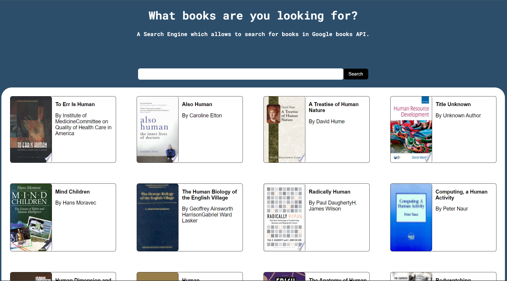
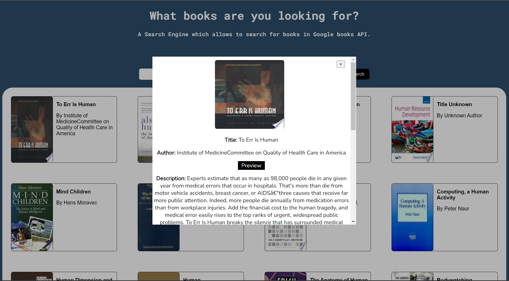

# Google Books API Search Engine

Launch App -  https://srilekha25.github.io/srilekha25-google-books/

# Project Features





# Overview
To create a web application that fetches data from the Google Books API and displays them on the screen. Further information about the books (image, description, preview link) should be displayed. 

# Requirements
# MVP
* Fetch and display a list of books related to the provided name in the search Bar from the following REST API: https://www.googleapis.com/books/v1/volumes?q={SearchTerm}
* Present the fetched data in UI, including book title, authors.
* Enable users to view more details of a selected book, such as title, subtitle, authors, image, and description.
* Showcase creativity and add a personal touch to the application.
* Include a README file explaining the app's features and the creative elements introduced.

# Tech Stack
* React: To create a responsive and modular frontend with reusable components.

# Build Steps
Run the Frontend React application, by executing the following commands from the root folder of this project:

```
cd srilekha25-google-books
npm install
npm run dev
```

# Design Goals
For the design, I kept it simple with minimal styles yet clearly displayed all the data. I had a dark background and Cards displayed in white as the contrast will give the User more focus on the Data. On Furthur clicking on the book, a modal should up to display more details of the book.

# Approach
* Fetch the books using the URL and print it in the console.
* Using react useState, store all the books.
* Display and style the books in UI.
* Design a modal to view more about the books.
* Update the Readme.

# Features
* Single page react application with a Search Bar and Books Cards to display the results. The app is designed to display related books based on the input given in the Search Bar.

* The Landing page of the application consists of a Search Bar which takes input to fetch and displays a list of books related to Search Term from the following REST API: https://www.googleapis.com/books/v1/volumes?q={Search Term} by default. By Default, the app displays 20 books to the User. If an error occurs while fetching data, the user will see a message indicating that "Couldn't find any books", rather than the application appearing to do nothing. The app displays "Loading" state while fetching the data.

* The data is presented in a Card which includes the book Image, title, authors. If the data is missing the app shows relevant information rather than displaying empty fields. For example the author or published date may be missing. App handles the missing data by displaying "UnKnown Author" or "No Title" to let the user know that the information is not available. A default image source is used for books with missing image links.

* By clicking on the Book Card of the book users can view more details. By clicking on it opens a modal which displays the details of the selected book. Image, title, author and description and preview button of the books are displayed in the modal. If the book's title or author(s) are missing, "UnKnown Author" is rendered. A back button is provided to go back to main page, closes the modal and can view all the books.

* If the user wants to read the book, by clicking on the preview button the page loads the book in different window to ensure the users can open as many books as they want.


# Challenges

* Understanding React and diving the components is bit of a challenge because this was the first project I have ever done in React.

# Future Goals
* To implement the project in react-redux.

# Log
25/06/2023 - Updated Readme.

